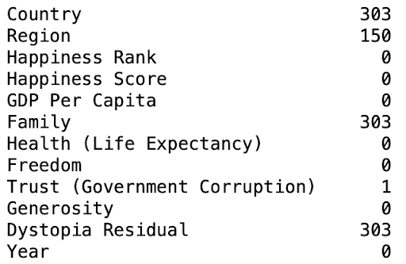
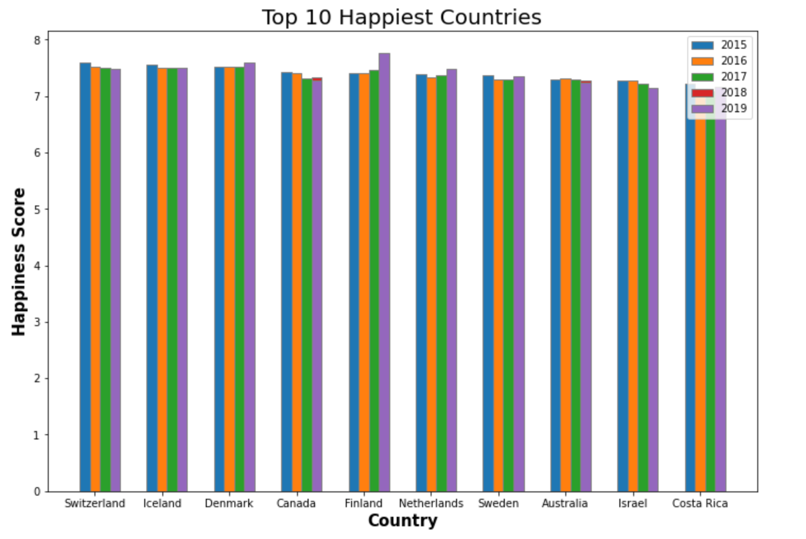

# World Happiness Report

## Project Overview

This project aims to identify the three variables that most significantly affect a country's happiness, as measured by the World Happiness Report. The analysis uses data from 2015 to 2019, examining various factors that contribute to the overall happiness score of different nations.

## Variables Summary

- **GDP (per capita):** The total gross value of a country's economic output for each person, divided by the population.
- **Family:** The national average response to the question, _"If you were in trouble, do you have relatives or friends you can count on to help you whenever you need them, or not?"_
- **Health Life Expectancy (HLE):** The ratio comparing total life expectancy to healthy life expectancy.
- **Freedom:** The average of binary responses to the question, _"Are you satisfied or dissatisfied with your freedom to choose what you do with your life?"_
- **Trust (Government):** The average of binary responses to the question, _"Is corruption widespread throughout the government or not?"_
- **Generosity:** The average of binary responses to the question, _"Have you donated money to a charity in the past month?"_
- **Dystopia:** Represents the lowest national averages of all the variables above, compared to a hypothetical country known as Dystopia.
- **Happiness:** Calculated by summing the six variables above and used to rank each nation.

## Data Processing

> ### Cleaning the Data

- Checked to see if there are any missing data
- Split data into years (2015-2019) to better understand the missing data patterns
- Countries were in the region column
- Merged all the years by country
- Split data once again by year for detailed examination

    

## Datasets

The datasets are categorized by year, from 2015 to 2019.

## Analysis

> ### Linear Regression

- **Columns vs Happiness Score:** Analyzed columns relative to happiness scores for the years 2015 to 2019.
  > ### Multiple Linear Regression
- **Graphs:** Visualized relationships and trends.
- **Model Evaluation:**
  - _R² Coefficient:_ Measures the proportion of variance explained by the model.
  - _Mean Square Error:_ Assesses the average squared difference between predicted and actual values.
  - _Multicollinearity:_ Evaluated to ensure predictor variables are not highly correlated.

### Conclusion

Based on the analysis, the three variables that most affect a country's happiness are:

1. **GDP Per Capita**
2. **Family**
3. **Health Life Expectancy (HLE)**

These variables were found to have the most significant impact on happiness scores across the analyzed years.
